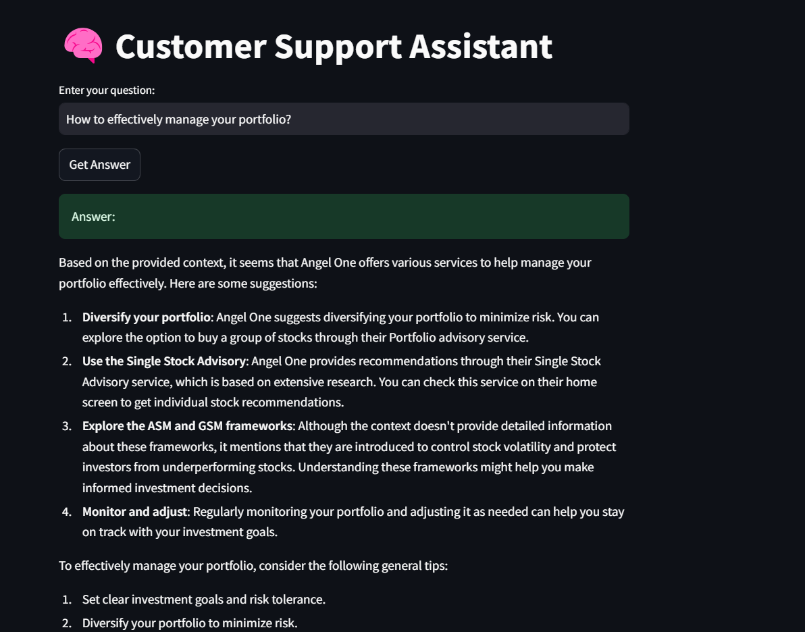
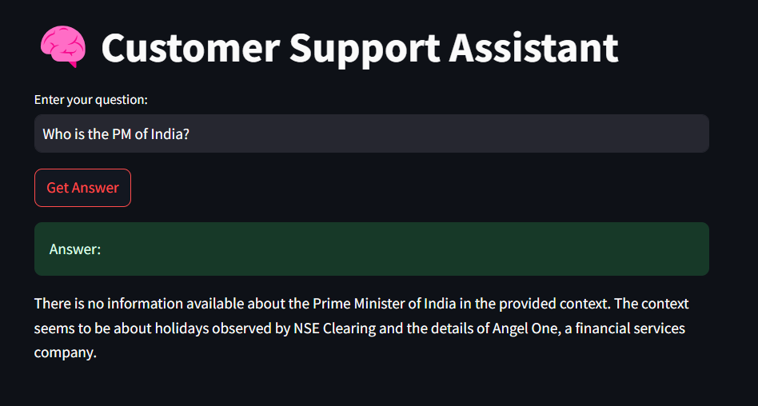

# 🤖 RAG Chatbot for Customer Support

A Retrieval-Augmented Generation (RAG) chatbot designed to assist with customer support by retrieving relevant information from documentation and generating answers using **Groq's LLaMA-3.1-8B** model. It includes a user-friendly **Streamlit UI** and strictly answers based on the given context.

> 💡 For out-of-scope queries, the chatbot responds with **"I don't know."**

---

## 🚀 Features

- 🔍 **Document Retrieval**  
  Retrieves top 3 relevant documents using **Pinecone**.

- 🤖 **Answer Generation**  
  Uses **Groq's LLaMA-3.1-8B** model for context-aware responses.

- ❓ **Out-of-Scope Handling**  
  Replies with _"I don't know"_ when content is missing from the docs.

- 🖥️ **User Interface**  
  Built with **Streamlit**; includes expandable context views.

- 🧱 **Modular Design**  
  Clean separation between UI (`interface.py`) and logic (`rag_chain.py`).

---

## 📁 Project Structure

```
CUSTOMER-SUPPORT-RAG/
├── app/
│   ├── __pycache__/
│   ├── documents.json              # Document texts
│   ├── ingest.ipynb                # Data ingestion notebook
│   ├── interface.py                # Streamlit UI
│   └── rag_chain.py                # Core RAG logic
├── data/
│   ├── angelone_quick_10_links_support_data.json
│   ├── angelone_support_full_data.json
│   └── insurance_pdfs_text.json
├── Data Gathering/
│   ├── data_gathering.ipynb
│   └── Insurance PDFs/
│       └── (PDF text JSON files)
├── .env                            # Environment vars (GROQ_API_KEY)
├── README.md
├── requirements.txt
```

---

## 🛠️ Installation

Install the required dependencies:

```bash
pip install -r requirements.txt
```

### `requirements.txt` includes:

```txt
langchain==0.1.10
openai==1.19.0
pinecone
sentence-transformers==2.2.2
PyPDF2==3.0.1
pdfplumber==0.10.2
beautifulsoup4==4.12.3
requests==2.31.0
lxml==5.2.1
streamlit==1.33.0
tqdm==4.66.2
numpy==1.26.4
pandas==2.2.2
python-dotenv==1.0.1
```

---

## 🔑 Environment Setup

Create a `.env` file in the root directory with your Groq API key:

```
GROQ_API_KEY=your_groq_api_key_here
PINECONE_API_KEY=your_pinecone_api_key_here
```

---

## 🚦 Running the Application

### Step 1: Ingest Data

Run `ingest.ipynb` to generate:

- `documents.json`

### Step 2: Start Streamlit App

```bash
streamlit run app/interface.py
```

### Step 3: Interact with Chatbot

- Open browser: [http://localhost:8501](http://localhost:8501)
- Ask questions related to support documents.
- View retrieved documents by expanding the UI panels.

---

## 🎯 Example Responses

### ✅ In-Context Question
- The user asks a question that is present in the documents, so the chatbot provides a detailed answer.


### ❌ Out-of-Context Question
- The user asks a question that is not covered in the documents, so the chatbot replies with:


--- 

## 📝 Notes

- Only answers based on provided documents.
- Keep `documents.json` inside `/app`.

---

## ❗ Troubleshooting

- **Missing FAISS Index**  
  → Re-run `ingest.ipynb`.

- **API Key Issues**  
  → Check your `.env` file and make sure it's loaded.

- **Dependency Errors**  
  → Ensure all packages are installed using the correct versions.

---

## 📚 References

- [LangChain Docs](https://docs.langchain.com/)
- [Pinecone](https://docs.pinecone.io/guides/get-started/overview)
- [Streamlit](https://streamlit.io/)
- [Groq API](https://groq.com/)